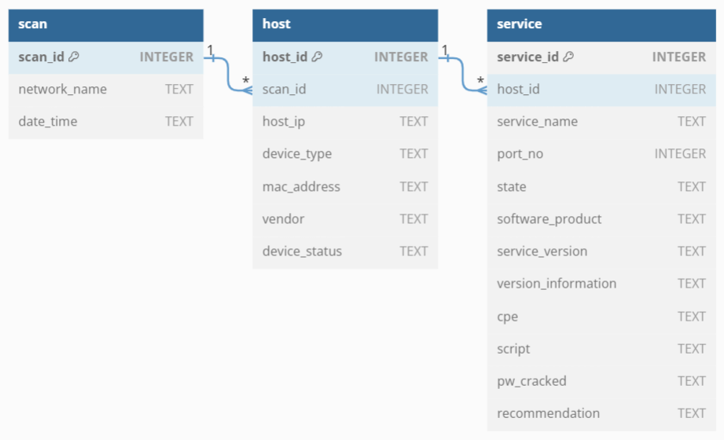

# Peruse
## What is Peruse?
Peruse is a proof-of-concept password scanner that allows you to identify devices in your home that have weak passwords. It currently makes use of the python-nmap library to scan your network to identify devices connected to it and any open ports on these devices. It then uses THC-Hydra binaries to attempt dictionary attacks on SSH to test for weak and commonly used passwords.

The nmap command to be run is hardcoded within [ScanThread.py](https://github.com/0venoven/Peruse/blob/main/src/ScanThread.py) on line 13. Currently, it is "nmap -oX - -A -T4 {ip}" where ip can be a single IP address or a range of IP addresses in CIDR format.

## Sqlite database structure
Peruse uses sqlite to create a local database (results.db) within the same directory containing three tables. If the .db file is missing or the tables are not created, the file and/or tables will be created upon starting the app.
The structure of the database is shown in the ER diagram below:

## Limitations
As Peruse is still in its initial stages of development, it has quite a few limitations:
- app is limited to running on windows for now
- lack of ability to check for password policies (possible integration with winpeas to do so)
- lack of a scoring system
- no device fingerprinting